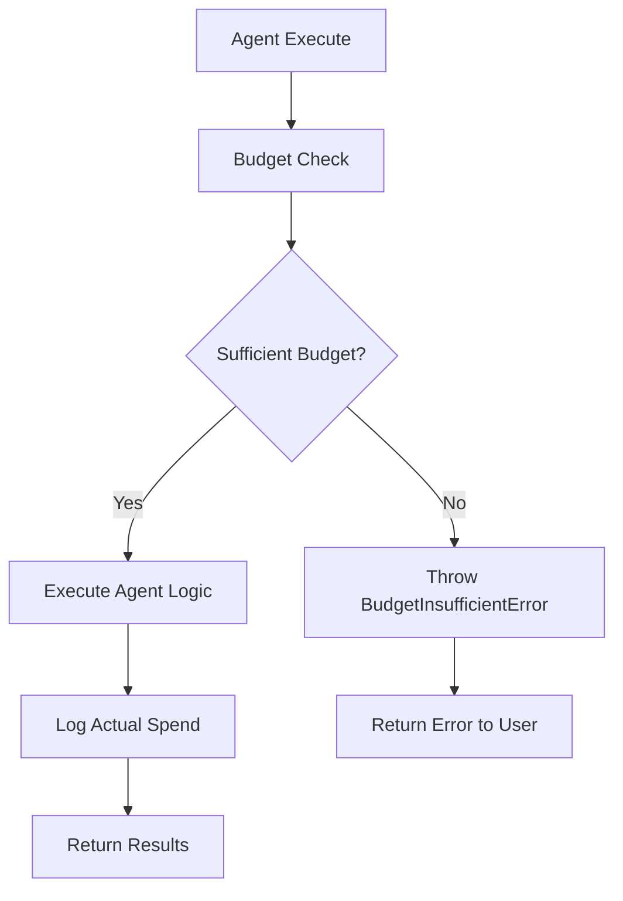

# Agent Budget Enforcement & Spend Tracking

## Overview

NeonHub's Agent Budget Enforcement system provides real-time budget limits and spend tracking across all AI agents. This system prevents agents from running when funds are low, deducts spend in real-time, and provides comprehensive logging and override capabilities.

## Features

✅ **Real-time Budget Enforcement** - Prevents agents from running if funds are insufficient  
✅ **Automatic Spend Deduction** - Tracks actual spending per agent execution  
✅ **Comprehensive Logging** - Logs all spend by agent, task, campaign, and user  
✅ **UI Warnings** - Displays budget warnings and errors in agent responses  
✅ **Admin Override** - Allows admin bypass of budget limits  
✅ **Cost Estimation** - Predicts agent execution costs before running  

## Architecture

### Budget Guard System

The budget enforcement is implemented through a `BillingGuard` singleton that:

1. **Pre-execution**: Checks budget before agent runs
2. **Post-execution**: Logs actual spend after completion
3. **Error handling**: Graceful fallbacks for system errors
4. **Override support**: Admin bypass capabilities

### Integration Points



## Cost Structure

### Base Agent Costs (per execution)

| Agent Type | Cost | Description |
|------------|------|-------------|
| CONTENT | $0.05 | Content generation |
| SEO | $0.03 | SEO optimization |
| EMAIL_MARKETING | $0.04 | Email campaigns |
| SOCIAL_POSTING | $0.03 | Social media posts |
| CUSTOMER_SUPPORT | $0.02 | Support responses |
| AD | $0.08 | Ad optimization (complex) |
| OUTREACH | $0.04 | B2B outreach |
| TREND | $0.03 | Trend analysis |
| INSIGHT | $0.06 | Business insights |
| DESIGN | $0.10 | Design generation |
| BRAND_VOICE | $0.02 | Brand voice analysis |

### Complexity Multipliers

| Complexity | Multiplier | Use Case |
|------------|------------|----------|
| Simple | 1.0x | Basic operations |
| Standard | 1.2x | Normal complexity (default) |
| Complex | 1.5x | Advanced operations |
| Premium | 2.0x | High-complexity tasks |

### Premium Task Multiplier (1.5x)

Tasks that include these keywords get an additional 1.5x multiplier:
- `generate_comprehensive_report`
- `create_campaign_strategy`
- `optimize_full_funnel`

## Usage Examples

### Basic Agent Execution

All agents automatically use budget enforcement through the base `AbstractAgent` class:

```typescript
// Agent execution automatically includes budget checking
const result = await socialAgent.execute({
  task: 'generate_post',
  context: {
    platform: 'instagram',
    topic: 'product launch',
  },
  metadata: {
    campaignId: 'camp_123',
    userId: 'user_456',
    complexity: 'standard', // Optional: simple, standard, complex, premium
  },
});
```

### Manual Budget Checking

For custom implementations or pre-flight checks:

```typescript
import { enforceAgentBudget } from '@neon/core-agents';

try {
  const budgetStatus = await enforceAgentBudget('CONTENT', 'generate_post', {
    campaignId: 'camp_123',
    userId: 'user_456',
    complexity: 'complex',
  });
  
  console.log('Budget check passed:', budgetStatus);
  // Proceed with agent execution
} catch (budgetError) {
  if (budgetError instanceof BudgetInsufficientError) {
    console.error('Insufficient budget:', {
      required: budgetError.requiredCost,
      available: budgetError.currentBudget,
      action: budgetError.suggestedAction,
    });
  }
}
```

### Manual Spend Logging

For custom logging scenarios:

```typescript
import { logAgentSpend } from '@neon/core-agents';

await logAgentSpend('CONTENT', 0.08, {
  campaignId: 'camp_123',
  task: 'generate_post',
  userId: 'user_456',
  executionId: 'exec_789',
  tokens: 1500,
  executionTime: 3200, // milliseconds
  success: true,
  metadata: {
    platform: 'instagram',
    contentType: 'story',
  },
});
```

## Error Handling

### Budget Insufficient Error

When budget is insufficient, agents return a structured error:

```typescript
{
  success: false,
  error: "💸 Insufficient budget for CONTENT. Required: $0.05, Available: $0.02",
  metadata: {
    errorType: "BUDGET_INSUFFICIENT",
    currentBudget: 0.02,
    requiredCost: 0.05,
    suggestedAction: "Visit your billing dashboard to add funds via Stripe",
    agentId: "content-agent-001",
    agentName: "ContentAgent"
  }
}
```

### System Error Fallback

If the budget system fails, agents continue execution to prevent system breakdown:

```typescript
{
  success: true,
  data: { /* normal result */ },
  metadata: {
    budgetWarning: "Budget check failed - execution allowed",
    // ... normal metadata
  }
}
```

## Admin Override

### Enable Override

```typescript
// Via tRPC API
await trpc.billing.setBudgetOverride.mutate({
  enabled: true,
  month: '2024-01',
  adminId: 'admin_123',
  reason: 'Emergency campaign launch',
});
```

### Check Override Status

```typescript
const status = await trpc.billing.getBudgetOverrideStatus.query();
console.log('Override enabled:', status.overrideEnabled);
```

### Programmatic Override

```typescript
import { BillingGuard } from '@neon/core-agents';

const guard = BillingGuard.getInstance();
guard.setOverride(true); // Enable override
guard.setOverride(false); // Disable override

console.log('Override status:', guard.isOverrideEnabled());
```

## Budget Management API

### Get Budget Status

```typescript
const status = await trpc.billing.getBudgetStatus.query({
  month: '2024-01', // Optional, defaults to current month
});

console.log({
  totalBudget: status.totalBudget,
  totalSpent: status.totalSpent,
  remainingBudget: status.remainingBudget,
  utilizationPercentage: status.utilizationPercentage,
  isOverBudget: status.isOverBudget,
  isNearBudget: status.isNearBudget,
});
```

### Add Funds

```typescript
await trpc.billing.addFunds.mutate({
  email: 'user@company.com',
  amount: 100.00,
  source: 'manual_topup',
  metadata: {
    adminId: 'admin_123',
    campaign: 'urgent_launch',
  },
});
```

### View Agent Spend History

```typescript
const events = await trpc.billing.getStripeEvents.query({
  limit: 50,
  eventType: 'checkout.session.completed', // Optional filter
});

console.log('Recent transactions:', events.events);
```

## Monitoring & Analytics

### Budget Utilization Tracking

```typescript
const utilization = await trpc.billing.getMonthlySpendSummary.query({
  month: '2024-01',
});

console.log({
  budgetAmount: utilization.budgetAmount,
  totalSpent: utilization.totalSpent,
  utilizationPercentage: utilization.utilizationPercentage,
  campaignBreakdown: utilization.campaignBreakdown,
});
```

### Agent Cost Analysis

```typescript
const agentCosts = await trpc.billing.getAgentCosts.query({
  month: '2024-01',
  agentType: 'CONTENT', // Optional filter
});

console.log('Agent performance:', agentCosts.agentSummary);
```

## Configuration

### Environment Variables

```bash
# Budget enforcement settings
BILLING_API_URL=http://localhost:3000/api/trpc
ENABLE_BUDGET_ENFORCEMENT=true

# Stripe integration (for top-ups)
STRIPE_SECRET_KEY=sk_live_...
STRIPE_WEBHOOK_SECRET=whsec_...
```

### Default Budget Settings

- **Initial Budget**: $1,000 per month
- **Alert Threshold**: 80% of budget
- **Override**: Disabled by default
- **Error Handling**: Graceful fallback on system errors

## Best Practices

### 1. Budget Planning

```typescript
// Estimate costs before launching campaigns
const estimatedCost = campaignPosts.length * 0.05; // Content agent cost
const currentBudget = await getCurrentBudget();

if (estimatedCost > currentBudget * 0.5) {
  console.warn('Campaign will use >50% of budget');
}
```

### 2. Complexity Tagging

```typescript
// Tag complex operations appropriately
await agent.execute({
  task: 'generate_comprehensive_report',
  context: { /* ... */ },
  metadata: {
    complexity: 'premium', // Will apply 2.0x multiplier
    campaignId: 'camp_123',
  },
});
```

### 3. Campaign Budget Allocation

```typescript
// Allocate budget per campaign
const campaignBudget = 50.00;
const estimatedExecutions = campaignBudget / 0.05; // ~1000 content generations

console.log(`Campaign can support ~${estimatedExecutions} agent executions`);
```

### 4. Monitor Utilization

```typescript
// Check budget regularly
const status = await trpc.billing.getBudgetStatus.query();

if (status.utilizationPercentage > 80) {
  console.warn('Budget usage high - consider topping up');
}

if (status.isNearBudget) {
  // Send notifications or reduce agent usage
}
```

## Testing

### Unit Tests

```bash
cd packages/core-agents
npm test -- billingGuard.test.ts
```

### Integration Tests

```typescript
// Test with actual budget limits
describe('Agent Budget Integration', () => {
  it('should prevent execution when budget is zero', async () => {
    await setBudget(0);
    
    const result = await contentAgent.execute({
      task: 'generate_post',
      context: { topic: 'test' },
    });
    
    expect(result.success).toBe(false);
    expect(result.error).toContain('Insufficient budget');
  });

  it('should allow execution when budget is sufficient', async () => {
    await setBudget(100);
    
    const result = await contentAgent.execute({
      task: 'generate_post',
      context: { topic: 'test' },
    });
    
    expect(result.success).toBe(true);
  });
});
```

## Troubleshooting

### Common Issues

#### 1. Budget Check Fails
```
Error: Budget check system error
```
**Solution**: Check database connection and billing API availability

#### 2. Agents Not Logging Spend
```
Warning: Failed to log agent spend
```
**Solution**: Verify tRPC billing router is accessible and database is writable

#### 3. Override Not Working
```
Budget override enabled but agents still blocked
```
**Solution**: Check that override is set on the correct `BillingGuard` instance

### Debug Commands

```bash
# Check budget status
curl -X POST http://localhost:3000/api/trpc/billing.getBudgetStatus \
  -H "Content-Type: application/json" \
  -d '{}'

# Check override status
curl -X POST http://localhost:3000/api/trpc/billing.getBudgetOverrideStatus \
  -H "Content-Type: application/json"
```

## Production Deployment

### 1. Database Migration

Ensure the `BILLING` agent type is in your Prisma schema:

```bash
npx prisma migrate deploy
```

### 2. Environment Setup

Set required environment variables in production:

```bash
BILLING_API_URL=https://your-domain.com/api/trpc
ENABLE_BUDGET_ENFORCEMENT=true
```

### 3. Monitoring Setup

- Set up alerts for budget utilization > 90%
- Monitor agent spend logs for anomalies
- Track override usage for compliance

### 4. Budget Initialization

```typescript
// Initialize monthly budget for new deployments
await trpc.billing.updateMonthlyBudget.mutate({
  month: '2024-01',
  totalBudget: 1000.00,
  alertThreshold: 0.8,
});
```

## Support

For issues with budget enforcement:

1. Check agent execution logs for budget errors
2. Verify billing API connectivity
3. Review budget status and utilization
4. Check override settings if needed
5. Contact development team for system issues

---

**Last Updated**: January 2024  
**Version**: 1.0.0  
**Compatibility**: NeonHub v2.2+ 