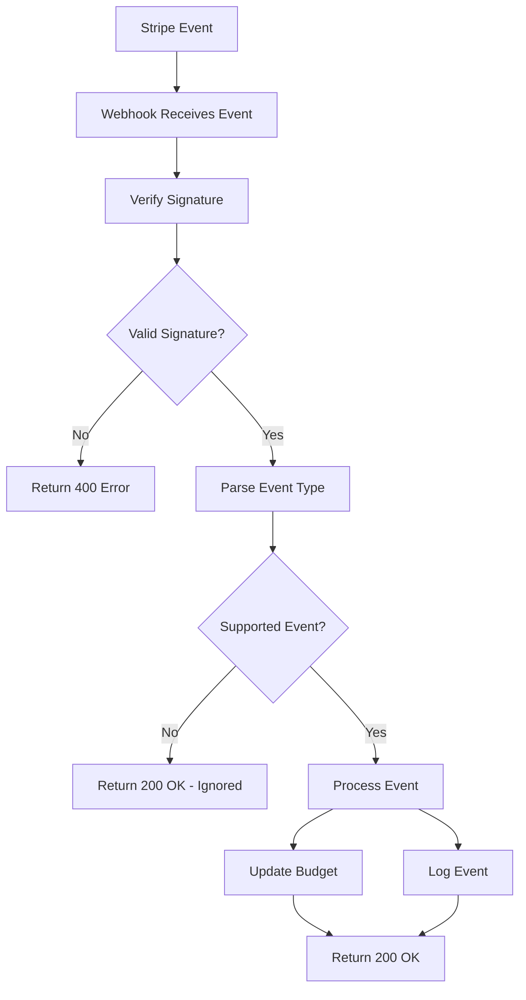

# Stripe Webhook Integration for NeonHub Billing

## Overview

NeonHub's Stripe webhook listener provides secure, real-time processing of billing events from Stripe. This implementation handles budget top-ups, subscription changes, and maintains a comprehensive audit trail for all billing activities.

## Features

✅ **Secure Signature Validation** - Uses Stripe's webhook signature verification  
✅ **Budget Auto-Top-Up Handler** - Automatically adds funds to marketing budgets  
✅ **Subscription & Invoice Event Logging** - Tracks all billing events with detailed metadata  
✅ **Idempotency-Safe Processing** - Prevents duplicate processing of events  
✅ **Integration with Billing Dashboard** - Connects with existing budget tracking system  

## Supported Events

The webhook handles the following Stripe events:

| Event Type | Description | Action |
|------------|-------------|--------|
| `checkout.session.completed` | Successful payment via Checkout | Add funds to budget |
| `invoice.payment_succeeded` | Successful invoice payment | Add funds to budget |
| `customer.subscription.updated` | Subscription plan changes | Log event |
| `customer.subscription.deleted` | Subscription cancellation | Log event |
| `customer.subscription.created` | New subscription created | Log event |
| `invoice.payment_failed` | Failed payment attempt | Log event |

## Installation & Setup

### 1. Environment Variables

Add these variables to your `.env` file:

```bash
# Stripe Configuration
STRIPE_SECRET_KEY=sk_live_your_secret_key_here
STRIPE_WEBHOOK_SECRET=whsec_your_webhook_secret_here
```

### 2. Database Schema

The webhook uses the existing `MonthlyBudget` and `BillingLog` models. Ensure your database is migrated:

```bash
npx prisma migrate deploy
```

### 3. Webhook Endpoint

The webhook is available at:
```
POST /api/webhooks/stripe
```

### 4. Stripe Dashboard Configuration

1. Go to your Stripe Dashboard → Developers → Webhooks
2. Add endpoint: `https://your-domain.com/api/webhooks/stripe`
3. Select events to listen for:
   - `checkout.session.completed`
   - `invoice.payment_succeeded`
   - `customer.subscription.updated`
   - `customer.subscription.deleted`
   - `customer.subscription.created`
   - `invoice.payment_failed`
4. Copy the webhook secret to your environment variables

## Testing

### Testing with Stripe CLI

```bash
# Install Stripe CLI
npm install -g stripe

# Login to your Stripe account
stripe login

# Forward webhooks to local development
stripe listen --forward-to localhost:3000/api/webhooks/stripe

# Test specific events
stripe trigger checkout.session.completed
stripe trigger invoice.payment_succeeded
```

### Manual Testing with cURL

```bash
# Health check
curl -X GET https://your-domain.com/api/webhooks/stripe

# Response:
{
  "status": "healthy",
  "timestamp": "2024-01-15T10:30:00.000Z",
  "supportedEvents": [
    "checkout.session.completed",
    "invoice.payment_succeeded",
    "customer.subscription.updated",
    "customer.subscription.deleted",
    "invoice.payment_failed",
    "customer.subscription.created"
  ]
}
```

### Integration with tRPC

The webhook integrates with your existing tRPC billing router:

```typescript
// Get budget status after webhook processes
const budgetStatus = await trpc.billing.getBudgetStatus.query({
  month: '2024-01'
});

// View Stripe webhook events
const stripeEvents = await trpc.billing.getStripeEvents.query({
  limit: 10,
  eventType: 'checkout.session.completed'
});

// Manually add funds (for admin use)
await trpc.billing.addFunds.mutate({
  email: 'user@example.com',
  amount: 100.00,
  source: 'manual_topup',
  metadata: { adminId: 'admin123' }
});
```

## Event Processing Flow



## Error Handling

The webhook implements comprehensive error handling:

- **400 Bad Request**: Invalid signature or malformed payload
- **500 Internal Server Error**: Database errors or processing failures
- **200 OK**: Successful processing or ignored events

All errors are logged with detailed context for debugging.

## Security Features

### Signature Verification
```typescript
const event = stripe.webhooks.constructEvent(
  rawBody,
  signature,
  process.env.STRIPE_WEBHOOK_SECRET!
);
```

### Idempotency
The webhook is idempotent - processing the same event multiple times won't create duplicate budget entries.

### Audit Trail
All webhook events are logged with:
- Stripe event ID
- Event type
- Customer information
- Processing timestamp
- Metadata

## Budget Management

### Automatic Top-Ups

When a successful payment is processed:

1. Amount is converted from cents to dollars
2. Current month's budget is increased by the payment amount
3. Alert flags are reset if budget was previously exceeded
4. Event is logged for audit purposes

### Budget Structure

```typescript
interface MonthlyBudget {
  month: string;        // "2024-01"
  totalBudget: number;  // Total available budget
  totalSpent: number;   // Amount spent so far
  alertThreshold: number; // Alert when % reached (0.8 = 80%)
  isAlertSent: boolean; // Whether alert was sent
}
```

## Monitoring & Debugging

### Webhook Logs

View webhook activity through the billing dashboard:

```typescript
// Get recent webhook events
const events = await trpc.billing.getStripeEvents.query({
  limit: 50,
  offset: 0
});

// Filter by event type
const checkoutEvents = await trpc.billing.getStripeEvents.query({
  eventType: 'checkout.session.completed'
});
```

### Budget Status

Monitor budget health:

```typescript
const status = await trpc.billing.getBudgetStatus.query({
  month: '2024-01'
});

console.log({
  totalBudget: status.totalBudget,
  totalSpent: status.totalSpent,
  remainingBudget: status.remainingBudget,
  utilizationPercentage: status.utilizationPercentage,
  isOverBudget: status.isOverBudget,
  isNearBudget: status.isNearBudget
});
```

## Testing

### Unit Tests

Run the webhook tests:

```bash
cd apps/api
npm test -- --testNamePattern="Stripe Webhook"
```

### Integration Tests

Test the complete flow:

```bash
# Start local server
npm run dev

# In another terminal, use Stripe CLI
stripe listen --forward-to localhost:3000/api/webhooks/stripe
stripe trigger checkout.session.completed
```

## Production Deployment

### Webhook URL Configuration

Update your production webhook URL in Stripe Dashboard:
```
https://your-production-domain.com/api/webhooks/stripe
```

### Environment Variables

Ensure production environment has:
- `STRIPE_SECRET_KEY` (live key)
- `STRIPE_WEBHOOK_SECRET` (production webhook secret)

### Monitoring

Monitor webhook health:
- Check webhook logs in Stripe Dashboard
- Monitor application logs for errors
- Set up alerts for failed webhooks

## Common Issues & Solutions

### Issue: Webhook signature verification fails
**Solution**: Ensure `STRIPE_WEBHOOK_SECRET` matches the secret from Stripe Dashboard

### Issue: Events not being processed
**Solution**: Check that event types are selected in Stripe webhook configuration

### Issue: Budget not updating
**Solution**: Verify customer email is present in Stripe events and database connection is working

### Issue: Duplicate processing
**Solution**: Webhook is idempotent by design, but check for multiple webhook endpoints

## API Reference

### Webhook Endpoints

#### `POST /api/webhooks/stripe`
Process Stripe webhook events

**Headers:**
- `stripe-signature`: Webhook signature for verification

**Response:**
```json
{
  "received": true
}
```

#### `GET /api/webhooks/stripe`
Health check endpoint

**Response:**
```json
{
  "status": "healthy",
  "timestamp": "2024-01-15T10:30:00.000Z",
  "supportedEvents": ["checkout.session.completed", "..."]
}
```

### tRPC Methods

#### `billing.addFunds`
Manually add funds to budget

```typescript
await trpc.billing.addFunds.mutate({
  email: 'user@example.com',
  amount: 100.00,
  source: 'manual_topup',
  metadata: { note: 'Admin adjustment' }
});
```

#### `billing.getBudgetStatus`
Get current budget status

```typescript
const status = await trpc.billing.getBudgetStatus.query({
  month: '2024-01' // optional, defaults to current month
});
```

#### `billing.getStripeEvents`
Get webhook event history

```typescript
const events = await trpc.billing.getStripeEvents.query({
  limit: 50,
  offset: 0,
  eventType: 'checkout.session.completed' // optional
});
```

## Support

For issues with the Stripe webhook:

1. Check webhook logs in Stripe Dashboard
2. Review application logs for errors
3. Verify environment variables are set correctly
4. Test with Stripe CLI for local development
5. Contact development team for production issues

---

**Last Updated**: January 2024  
**Version**: 1.0.0  
**Compatibility**: NeonHub v2.2+ 