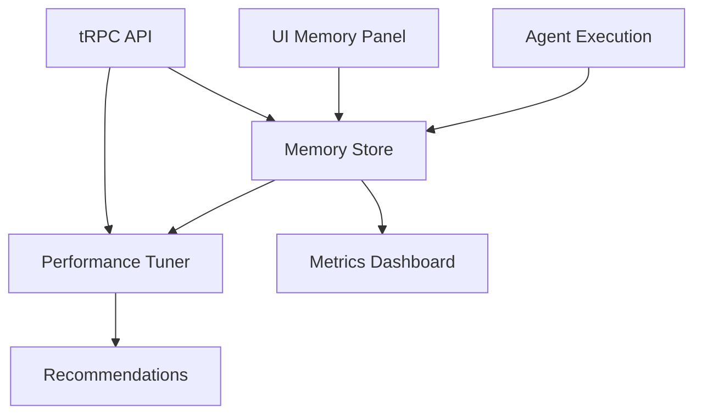

# Agent Memory Engine + Performance Tuning Layer

## Overview

The Agent Memory Engine + Performance Tuning Layer is a comprehensive system
that enables NeonHub agents to learn from their interactions, track performance
metrics, and automatically optimize their behavior over time. This system
provides personalized responses, historical awareness, and autonomous
performance optimization.

## Architecture



## Components

### 1. AgentMemoryStore

**Location**: `packages/core-agents/src/memory/AgentMemoryStore.ts`

The central component for tracking agent interactions and results per
session/user.

#### Key Features:

- **Memory Storage**: Stores input, output, metadata, and performance metrics
  for each agent execution
- **Metrics Calculation**: Generates comprehensive performance metrics including
  success rates, costs, and execution times
- **Trend Analysis**: Tracks performance trends over time with daily
  aggregations
- **Query Interface**: Flexible querying with filtering by agent, session, date
  range, and success status
- **Data Cleanup**: Automatic cleanup of old memory entries

#### Core Methods:

```typescript
// Store a new memory entry
storeMemory(agentId, sessionId, input, output, metadata): Promise<MemoryEntry>

// Get memory entries with filtering
getMemories(options: MemoryQueryOptions): Promise<MemoryEntry[]>

// Get comprehensive metrics for an agent
getAgentMetrics(agentId, days): Promise<MemoryMetrics>

// Get recent successful runs for context
getLastSuccessfulRuns(agentId, count): Promise<MemoryEntry[]>

// Clean up old memories
clearOldMemories(olderThanDays): Promise<number>
```

### 2. PerformanceTuner

**Location**: `packages/core-agents/src/tuner/PerformanceTuner.ts`

Analyzes agent performance and generates optimization recommendations.

#### Key Features:

- **Performance Analysis**: Comprehensive analysis of cost, execution time,
  success rate, and token efficiency
- **Benchmarking**: Compares agent performance against system benchmarks and
  peer agents
- **Recommendation Engine**: Generates actionable recommendations with priority
  levels and expected impact
- **Health Scoring**: Calculates overall health scores (0-100) for agents
- **System-wide Analysis**: Provides insights across all agents

#### Core Methods:

```typescript
// Analyze performance for a specific agent
analyzeAgent(agentId, days): Promise<AgentPerformanceProfile>

// Analyze system-wide performance
analyzeSystem(days): Promise<SystemWideAnalysis>
```

#### Performance Benchmarks:

- **Cost Per Run**: Excellent (<$0.01), Good (<$0.05), Fair (<$0.10), Poor
  (>$0.25)
- **Execution Time**: Excellent (<1s), Good (<5s), Fair (<15s), Poor (>30s)
- **Success Rate**: Excellent (>95%), Good (>90%), Fair (>80%), Poor (<70%)
- **Token Efficiency**: Excellent (<100), Good (<500), Fair (<1000), Poor
  (>2000)

### 3. Database Schema

**Location**: `packages/data-model/prisma/schema.prisma`

```prisma
model AgentMemory {
  id            String   @id @default(cuid())
  agentId       String
  sessionId     String
  userId        String?
  input         Json
  output        Json
  timestamp     DateTime @default(now())
  score         Int?
  tokensUsed    Int      @default(0)
  cost          Float    @default(0.0)
  executionTime Int      @default(0) // milliseconds
  success       Boolean  @default(true)
  errorMessage  String?
  metadata      Json?
  user          User?    @relation(fields: [userId], references: [id])

  @@index([agentId])
  @@index([sessionId])
  @@index([userId])
  @@index([timestamp])
  @@map("agent_memory")
}
```

### 4. Enhanced AbstractAgent

**Location**: `packages/core-agents/src/base-agent.ts`

All agents now automatically store their execution results in memory for
learning and analysis.

#### Enhanced Features:

- **Automatic Memory Storage**: Every execution is automatically logged
- **Context Awareness**: Agents can access their successful execution history
- **Performance Tracking**: Built-in token and cost tracking
- **Error Handling**: Failed executions are logged for analysis

#### New Methods:

```typescript
// Get last successful runs for context
getLastSuccessfulRuns(count): Promise<any[]>

// Get agent performance metrics
getPerformanceMetrics(days): Promise<MemoryMetrics>

// Extract tokens used (overridable by specific agents)
extractTokensUsed(result): number

// Estimate cost (overridable by specific agents)
estimateCost(result): number
```

### 5. tRPC API Layer

**Location**: `apps/api/src/server/routers/agent-memory.ts`

Comprehensive API endpoints for memory and performance data.

#### Available Endpoints:

- `agentMemory.getMemory` - Get agent memory and metrics
- `agentMemory.getSystemMemory` - Get system-wide analysis
- `agentMemory.storeMemory` - Store new memory entry
- `agentMemory.updateMemoryScore` - Update memory score for feedback
- `agentMemory.clearMemory` - Clear old memories
- `agentMemory.getPerformanceAnalysis` - Get performance analysis
- `agentMemory.getTuningRecommendations` - Get tuning recommendations
- `agentMemory.getHighCostRuns` - Get high-cost runs for analysis
- `agentMemory.getFailedRuns` - Get failed runs for debugging
- `agentMemory.healthCheck` - System health check

### 6. UI Memory Panel

**Location**: `apps/dashboard/src/app/memory/page.tsx`

Interactive dashboard for viewing agent memory and performance metrics.

#### Features:

- **Agent Selection**: View metrics for any specific agent
- **Time Range Filtering**: 7, 30, or 90-day views
- **Real-time Charts**: Cost trends, performance trends, success rates
- **Memory Log**: Recent execution history with detailed information
- **Performance Recommendations**: Actionable optimization suggestions
- **Health Scoring**: Visual health indicators and trend analysis

#### Key Metrics Displayed:

- Health Score (0-100 with color-coded status)
- Success Rate with trend indicators
- Average Cost per execution
- Average Response Time
- Recent execution history
- Performance recommendations with priority levels

### 7. React Hooks

**Location**: `apps/dashboard/src/lib/hooks/useAgentMemory.ts`

Custom hooks for accessing agent memory data in React components.

#### Available Hooks:

```typescript
// Hook for individual agent memory
useAgentMemory(options): {
  data, loading, error, refetch, clearMemory, updateScore
}

// Hook for system-wide memory analysis
useSystemMemory(days): {
  data, loading, error, refetch
}
```

## Usage Examples

### Storing Agent Memory

```typescript
import { AbstractAgent } from '@neon/core-agents';

class MyAgent extends AbstractAgent {
  async execute(payload: AgentPayload): Promise<AgentResult> {
    return this.executeWithErrorHandling(payload, async () => {
      // Your agent logic here
      const result = await this.performTask(payload);

      // Memory is automatically stored by executeWithErrorHandling
      return result;
    });
  }

  // Override for specific token tracking
  protected extractTokensUsed(result: unknown): number {
    return (result as any).usage?.total_tokens || 0;
  }

  // Override for specific cost calculation
  protected estimateCost(result: unknown): number {
    const tokens = this.extractTokensUsed(result);
    return (tokens / 1000) * 0.002; // $0.002 per 1K tokens
  }
}
```

### Accessing Memory in Agents

```typescript
class MyAgent extends AbstractAgent {
  async execute(payload: AgentPayload): Promise<AgentResult> {
    // Get context from previous successful runs
    const previousRuns = await this.getLastSuccessfulRuns(3);

    // Use previous context to improve current execution
    const context = this.buildContextFromHistory(previousRuns);

    return this.executeWithErrorHandling(payload, async () => {
      return await this.performTaskWithContext(payload, context);
    });
  }
}
```

### Using Performance Analysis

```typescript
import { PerformanceTuner, AgentMemoryStore } from '@neon/core-agents';

const memoryStore = new AgentMemoryStore();
const tuner = new PerformanceTuner(memoryStore);

// Analyze specific agent
const profile = await tuner.analyzeAgent('content-agent', 30);
console.log(`Health Score: ${profile.healthScore}`);
console.log(`Recommendations: ${profile.recommendations.length}`);

// System-wide analysis
const systemAnalysis = await tuner.analyzeSystem(30);
console.log(`Total Cost: $${systemAnalysis.totalCost}`);
console.log(`Top Performer: ${systemAnalysis.topPerformers[0].agentId}`);
```

### Using in React Components

```typescript
import { useAgentMemory } from '@/lib/hooks/useAgentMemory';

function AgentDashboard({ agentId }: { agentId: string }) {
  const { data, loading, error, refetch } = useAgentMemory({
    agentId,
    days: 30,
    autoRefresh: true,
  });

  if (loading) return <div>Loading...</div>;
  if (error) return <div>Error: {error.message}</div>;

  return (
    <div>
      <h2>{data?.agentName}</h2>
      <p>Health Score: {data?.healthScore}/100</p>
      <p>Success Rate: {data?.successRate.toFixed(1)}%</p>
      <p>Average Cost: ${data?.averageCost.toFixed(4)}</p>

      {data?.recommendations.map((rec, i) => (
        <div key={i} className={`recommendation ${rec.severity}`}>
          <h3>{rec.title}</h3>
          <p>{rec.description}</p>
          <p><strong>Recommendation:</strong> {rec.recommendation}</p>
          <p><strong>Expected Impact:</strong> {rec.expectedImpact}</p>
        </div>
      ))}
    </div>
  );
}
```

## Performance Recommendations

The system automatically generates recommendations based on performance
analysis:

### Cost Optimization

- **High Cost Per Execution**: Switch to cheaper models, optimize prompts
- **Inefficient Token Usage**: Refactor prompts, remove unnecessary context
- **System-wide Cost Issues**: Implement centralized cost management

### Performance Optimization

- **Slow Execution Time**: Implement caching, optimize API calls, consider async
  processing
- **Memory Inefficiency**: Optimize data structures, implement cleanup routines

### Reliability Improvements

- **Low Success Rate**: Implement retry logic, improve error handling, add input
  validation
- **High Error Rate**: Implement fallback strategies, improve monitoring

### Accuracy Enhancements

- **Low Quality Scores**: Improve prompts, add validation, implement feedback
  loops
- **Inconsistent Results**: Standardize processes, improve quality control

## Configuration

### Environment Variables

```env
DATABASE_URL=postgresql://...
MEMORY_RETENTION_DAYS=90
COST_THRESHOLD_WARNING=0.10
PERFORMANCE_THRESHOLD_WARNING=10000
```

### Benchmarks Configuration

Benchmarks can be customized in the PerformanceTuner constructor:

```typescript
const customBenchmarks = {
  costPerRun: {
    excellent: 0.005,
    good: 0.02,
    fair: 0.05,
    poor: 0.15,
  },
  // ... other benchmarks
};

const tuner = new PerformanceTuner(memoryStore, customBenchmarks);
```

## Monitoring and Alerts

### Health Monitoring

- **Health Scores**: Continuous monitoring of agent health (0-100 scale)
- **Trend Analysis**: Automatic detection of improving/declining performance
- **Critical Issues**: Immediate alerts for critical performance degradation

### Cost Monitoring

- **Budget Tracking**: Track spending per agent and system-wide
- **Cost Alerts**: Automatic alerts when costs exceed thresholds
- **Cost Optimization**: Recommendations for cost reduction

### Performance Monitoring

- **Execution Time Tracking**: Monitor response times and performance trends
- **Success Rate Monitoring**: Track reliability and identify failure patterns
- **Token Usage Monitoring**: Optimize AI model usage and costs

## Testing

Comprehensive test suite available in
`packages/core-agents/src/__tests__/agent-memory.test.ts`

### Running Tests

```bash
cd packages/core-agents
npm test -- agent-memory.test.ts
```

### Test Coverage

- Memory storage and retrieval
- Metrics calculation and aggregation
- Performance analysis and recommendations
- Trend detection and analysis
- Health score calculation
- Error handling and edge cases

## Future Enhancements

### Planned Features

1. **Machine Learning Integration**: Predictive performance modeling
2. **Advanced Analytics**: Deeper insights and pattern recognition
3. **Automated Optimization**: Self-tuning agents based on performance data
4. **Cross-Agent Learning**: Agents learning from each other's experiences
5. **Real-time Monitoring**: Live performance dashboards and alerts
6. **Integration with External Analytics**: Connect with business intelligence
   tools

### Scalability Considerations

- **Data Partitioning**: Partition memory data by time periods for better
  performance
- **Caching Layer**: Implement Redis caching for frequently accessed metrics
- **Batch Processing**: Process large volumes of memory data in batches
- **Archive Strategy**: Move old memory data to cold storage

## Conclusion

The Agent Memory Engine + Performance Tuning Layer provides a robust foundation
for intelligent, self-improving AI agents in the NeonHub ecosystem. By
automatically tracking performance, identifying optimization opportunities, and
providing actionable recommendations, this system enables continuous improvement
and optimal performance across all AI agents.

The modular design allows for easy extension and customization, while
comprehensive testing ensures reliability and accuracy. The user-friendly
dashboard provides clear visibility into agent performance and recommendations
for optimization.
