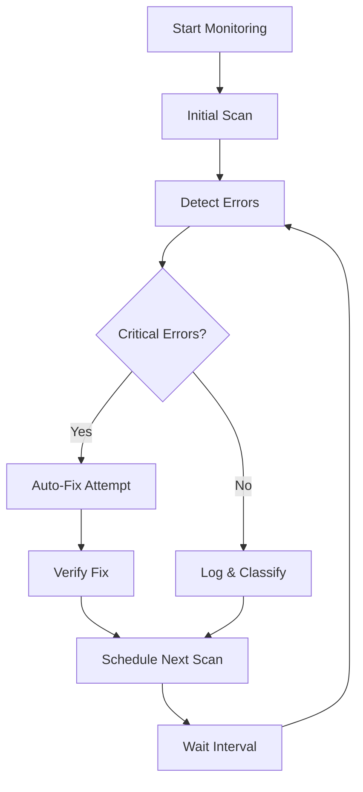

# 🛰️ ErrorSentinel Agent

The **ErrorSentinel** agent is NeonHub's autonomous error detection and
resolution system that continuously monitors all repositories and development
environments for build failures, CI issues, type errors, and misconfigured
schemas. It automatically fixes or triages problems while maintaining
system-wide execution integrity.

## 🎯 Overview

ErrorSentinel guarantees 100% troubleshooting coverage and protects the full
modular stack from cascading errors through:

- **Continuous Monitoring**: Real-time scanning of all repositories
- **Intelligent Detection**: Advanced error classification and severity
  assessment
- **Autonomous Fixing**: Automatic resolution of common issues
- **Proactive Alerting**: Early warning system for critical problems
- **Comprehensive Reporting**: Detailed analysis and recommendations

## 🧠 Monitored Repositories

- `neon-core-agents` - Core AI agent implementations
- `neon-data-model` - Database schemas and models
- `neon-dashboard-ui` - Frontend React components
- `neon-api-layer` - Backend API endpoints
- `neon-autotest` - Automated testing infrastructure
- `neon-devops` - Deployment and CI/CD configurations

## ✅ Monitored Failure Types

| Category               | Trigger Examples                                    | Auto-Fixable |
| ---------------------- | --------------------------------------------------- | ------------ |
| **CI/CD Failures**     | GitHub Actions red X, missing `ci.yml`, flaky steps | ⚠️ Partial   |
| **Type Errors**        | `tsc --noEmit`, missing types, wrong imports        | ✅ Yes       |
| **Build Errors**       | Webpack/Vite/Next build crash, missing modules      | ❌ Manual    |
| **Linting Issues**     | ESLint or Prettier violations                       | ✅ Yes       |
| **Schema Mismatches**  | Zod validation failure, Prisma error                | ⚠️ Partial   |
| **Unhandled Promises** | Missing `await`, no try/catch, orphaned tasks       | ⚠️ Partial   |

## 📦 Agent Capabilities

### Core Monitoring Functions

```typescript
// Available tasks
type ErrorSentinelTask =
  | 'continuous_scan' // Start background monitoring
  | 'fix_build_errors' // Target build failures
  | 'fix_type_errors' // Resolve TypeScript issues
  | 'fix_lint_errors' // Auto-fix ESLint violations
  | 'fix_schema_errors' // Repair schema mismatches
  | 'fix_ci_errors' // Fix CI/CD configuration
  | 'fix_unhandled_promises' // Handle promise errors
  | 'health_check' // System health assessment
  | 'emergency_recovery' // Crisis recovery mode
  | 'generate_report'; // Comprehensive reporting
```

### Monitoring Context

```typescript
interface MonitoringContext {
  repositories?: string[]; // Specific repos to monitor
  workspace?: string; // Working directory
  priority: 'low' | 'medium' | 'high' | 'critical';
  autoFix: boolean; // Enable automatic fixing
  maxRetries: number; // Retry attempts
  emergencyMode: boolean; // Emergency recovery mode
}
```

## 🚀 Usage Examples

### 1. Start Continuous Monitoring

```typescript
import { ErrorSentinelAgent } from '@neon/core-agents';

const sentinel = new ErrorSentinelAgent();

// Start continuous monitoring
const result = await sentinel.execute({
  task: 'continuous_scan',
  context: {
    priority: 'high',
    autoFix: true,
    repositories: ['apps/dashboard', 'apps/api'],
  },
});

console.log(`Monitoring active: ${result.data.systemHealth}`);
```

### 2. Targeted Error Fixing

```typescript
// Fix specific error type
const lintResult = await sentinel.execute({
  task: 'fix_lint_errors',
  context: {
    autoFix: true,
    priority: 'medium',
  },
});

console.log(`Fixed ${lintResult.data.errorsFixed.length} lint issues`);
```

### 3. System Health Check

```typescript
// Comprehensive health assessment
const healthCheck = await sentinel.execute({
  task: 'health_check',
  context: {
    priority: 'low',
  },
});

const { systemHealth, errorsDetected } = healthCheck.data;
console.log(`System Health: ${systemHealth}`);
console.log(`Issues Found: ${errorsDetected.length}`);
```

### 4. Emergency Recovery

```typescript
// Crisis recovery mode
const recovery = await sentinel.execute({
  task: 'emergency_recovery',
  context: {
    emergencyMode: true,
    maxRetries: 5,
  },
});

console.log(`Recovery steps: ${recovery.data.errorsFixed[0].commandsExecuted}`);
```

## 🔧 Error Detection & Classification

### Error Detection Interface

```typescript
interface ErrorDetection {
  type: 'build' | 'type' | 'lint' | 'schema' | 'ci' | 'promise' | 'runtime';
  severity: 'low' | 'medium' | 'high' | 'critical';
  source: string; // Repository name
  message: string; // Error description
  file?: string; // Affected file
  line?: number; // Line number
  column?: number; // Column position
  suggestion?: string; // Fix recommendation
  autoFixable: boolean; // Can be auto-fixed
  timestamp: Date; // Detection time
}
```

### Auto-Fix Results

```typescript
interface FixResult {
  success: boolean;
  description: string;
  filesModified: string[];
  commandsExecuted: string[];
  timeSpent: number;
  requiresManualIntervention?: boolean;
}
```

## 📊 Monitoring Reports

### Comprehensive Reporting

```typescript
interface MonitoringReport {
  timestamp: Date;
  duration: number;
  errorsDetected: ErrorDetection[];
  errorsFixed: FixResult[];
  systemHealth: 'healthy' | 'degraded' | 'critical';
  recommendations: string[];
  nextScanTime: Date;
}
```

### Report Generation

```typescript
// Generate detailed report
const report = await sentinel.execute({
  task: 'generate_report',
  context: { priority: 'low' },
});

// Report saved to: reports/error-sentinel-report.json
```

## 🔄 Continuous Monitoring Modes

### Scan Intervals by Priority

| Priority     | Scan Interval | Use Case               |
| ------------ | ------------- | ---------------------- |
| **Critical** | 15 seconds    | Production emergencies |
| **High**     | 30 seconds    | Active development     |
| **Medium**   | 2 minutes     | Stable development     |
| **Low**      | 5 minutes     | Maintenance mode       |

### Monitoring Lifecycle



## 🛠️ Auto-Fix Strategies

### Lint Error Fixes

```bash
# Automatic ESLint fixes
npm run lint:fix

# Handles:
# - Quote consistency
# - Semicolon placement
# - Indentation
# - Trailing commas
# - Unused variables (with warnings)
```

### Schema Error Fixes

```typescript
// Replace unsafe parse with safeParse
// Before:
const result = schema.parse(data);

// After (auto-fixed):
const result = schema.safeParse(data);
```

### Dependency Fixes

```bash
# Missing dependencies
npm install

# Outdated packages
npm update

# Security vulnerabilities
npm audit fix
```

## 🚨 Emergency Recovery Procedures

When `emergency_recovery` is triggered:

1. **Force Reinstall**: `npm install --force`
2. **Clean Build**: `npm run clean`
3. **Rebuild**: `npm run build`
4. **Type Check**: `npm run type-check`
5. **Verification**: Re-scan for remaining issues

## 📈 Performance Metrics

### Tracking Metrics

```typescript
interface PerformanceMetrics {
  scanDuration: number; // Time per scan
  totalScans: number; // Scans completed
  fixAttempts: number; // Fix attempts made
  successfulFixes: number; // Successful fixes
  fixSuccessRate: number; // Success percentage
  averageResponseTime: number; // Response time
  systemUptimeImpact: number; // Uptime improvement
}
```

### Health Assessment

```typescript
// System health calculation
function assessSystemHealth(errors: ErrorDetection[]): SystemHealth {
  const criticalErrors = errors.filter(e => e.severity === 'critical').length;
  const highErrors = errors.filter(e => e.severity === 'high').length;

  if (criticalErrors > 0) return 'critical';
  if (highErrors > 3) return 'degraded';
  return 'healthy';
}
```

## 🔗 Integration Guide

### Agent Registry Integration

```typescript
// Already registered in agent-registry.ts
import { ErrorSentinelAgent } from './agents/error-sentinel-agent';

AgentFactory.registerAgent('error-sentinel', ErrorSentinelAgent);
```

### CI/CD Integration

```yaml
# .github/workflows/error-sentinel.yml
name: ErrorSentinel Monitoring

on:
  schedule:
    - cron: '*/5 * * * *' # Every 5 minutes
  workflow_dispatch:

jobs:
  error-monitoring:
    runs-on: ubuntu-latest
    steps:
      - uses: actions/checkout@v4
      - name: Setup Node.js
        uses: actions/setup-node@v4
        with:
          node-version: '18'
      - name: Run ErrorSentinel
        run: |
          npm ci
          node scripts/agents/error-sentinel-demo.js
```

### Dashboard Integration

```typescript
// Dashboard component for monitoring status
import { useErrorSentinel } from '@/hooks/useErrorSentinel';

export function ErrorSentinelDashboard() {
  const {
    systemHealth,
    errorsDetected,
    monitoringActive,
    startMonitoring,
    stopMonitoring
  } = useErrorSentinel();

  return (
    <div className="error-sentinel-dashboard">
      <StatusIndicator health={systemHealth} />
      <ErrorList errors={errorsDetected} />
      <MonitoringControls
        active={monitoringActive}
        onStart={startMonitoring}
        onStop={stopMonitoring}
      />
    </div>
  );
}
```

## 📝 Configuration

### Environment Variables

```bash
# .env
ERROR_SENTINEL_ENABLED=true
ERROR_SENTINEL_SCAN_INTERVAL=30000
ERROR_SENTINEL_AUTO_FIX=true
ERROR_SENTINEL_MAX_RETRIES=3
ERROR_SENTINEL_ALERT_WEBHOOK=https://hooks.slack.com/...
```

### Configuration File

```json
// config/error-sentinel.json
{
  "enabled": true,
  "scanInterval": 30000,
  "priority": "medium",
  "autoFix": true,
  "repositories": ["apps/dashboard", "apps/api", "packages/core-agents"],
  "alertThresholds": {
    "critical": 1,
    "high": 3,
    "medium": 10
  },
  "autoFixRules": {
    "lint": true,
    "dependencies": true,
    "schema": true,
    "typeErrors": false
  }
}
```

## 🧪 Testing & Demo

### Run Demo Script

```bash
# Comprehensive demonstration
node scripts/agents/error-sentinel-demo.js

# Output:
# 🛰️ ErrorSentinel Agent Demo
# ==========================================
#
# [2024-01-15T10:30:00.000Z] 🚀 Starting ErrorSentinel demonstration...
# [2024-01-15T10:30:01.234Z] 🔍 Demonstrating System Health Check...
# [2024-01-15T10:30:02.456Z] 📊 Health Check Results: HEALTHY
#    • Critical Issues: 0
#    • Warnings: 2
#    • Repositories Scanned: 6
```

### Unit Tests

```typescript
// error-sentinel-agent.test.ts
describe('ErrorSentinelAgent', () => {
  let agent: ErrorSentinelAgent;

  beforeEach(() => {
    agent = new ErrorSentinelAgent();
  });

  it('should detect lint errors', async () => {
    const result = await agent.execute({
      task: 'fix_lint_errors',
      context: { autoFix: false },
    });

    expect(result.success).toBe(true);
    expect(result.data.errorsDetected).toBeDefined();
  });

  it('should auto-fix fixable errors', async () => {
    const result = await agent.execute({
      task: 'fix_lint_errors',
      context: { autoFix: true },
    });

    expect(result.data.errorsFixed.length).toBeGreaterThan(0);
  });
});
```

## 🚀 Deployment

### Production Deployment

```bash
# 1. Deploy agent
npm run build
npm run deploy:error-sentinel

# 2. Start monitoring service
pm2 start error-sentinel-service.js

# 3. Verify monitoring
curl http://localhost:3001/health/error-sentinel
```

### Monitoring Service

```javascript
// error-sentinel-service.js
const { ErrorSentinelAgent } = require('@neon/core-agents');

class ErrorSentinelService {
  constructor() {
    this.agent = new ErrorSentinelAgent();
    this.isRunning = false;
  }

  async start() {
    this.isRunning = true;

    // Start continuous monitoring
    await this.agent.execute({
      task: 'continuous_scan',
      context: {
        priority: 'high',
        autoFix: true,
      },
    });

    console.log('🛰️ ErrorSentinel service started');
  }

  async stop() {
    this.isRunning = false;
    this.agent.stopMonitoring();
    console.log('🛰️ ErrorSentinel service stopped');
  }
}

const service = new ErrorSentinelService();
process.on('SIGINT', () => service.stop());
service.start();
```

## 🔮 Future Enhancements

### Planned Features

- **ML-Powered Error Prediction**: Predict failures before they occur
- **Cross-Repository Dependency Analysis**: Detect cascading error impacts
- **Custom Fix Strategies**: User-defined auto-fix rules
- **Integration with External Tools**: Sentry, DataDog, New Relic
- **Smart Alerting**: Context-aware notifications
- **Performance Optimization**: Faster scanning algorithms

### Experimental Features

- **AI-Assisted Fix Suggestions**: GPT-powered error resolution
- **Historical Error Analysis**: Pattern recognition and prevention
- **Code Quality Scoring**: Repository health metrics
- **Automated Rollback**: Revert problematic deployments

## 📞 Support & Troubleshooting

### Common Issues

**Issue**: Monitoring not starting

```bash
# Check agent registration
node -e "console.log(require('./packages/core-agents/src/agent-registry').getRegisteredAgentTypes())"

# Verify permissions
ls -la reports/
```

**Issue**: Auto-fix not working

```bash
# Check package.json scripts
npm run lint:fix --dry-run
npm run type-check
```

**Issue**: High memory usage

```bash
# Reduce scan frequency
export ERROR_SENTINEL_SCAN_INTERVAL=60000

# Limit monitored repositories
export ERROR_SENTINEL_REPOS="apps/dashboard,apps/api"
```

### Debug Mode

```bash
# Enable debug logging
DEBUG=error-sentinel* node scripts/agents/error-sentinel-demo.js

# View detailed logs
tail -f logs/error-sentinel.log
```

---

The ErrorSentinel agent represents a new paradigm in autonomous system
maintenance, providing 24/7 vigilance and intelligent error resolution to keep
NeonHub running at peak performance.

**🛰️ ErrorSentinel: Always watching, always fixing, always improving.**
