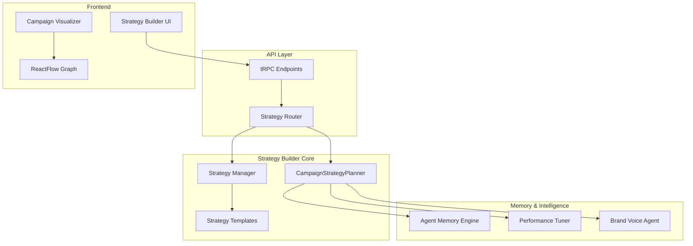

# Campaign Strategy Builder - Complete Implementation

## 🎯 Overview

The Autonomous Campaign Strategy Builder enables NeonHub's AI agents to
collaboratively design multi-step marketing campaigns. The system leverages the
Agent Memory Engine and brand knowledge to create intelligent, data-driven
campaign strategies.

## 🧩 System Architecture



## 🛠️ Core Components

### 1. CampaignStrategyPlanner (`packages/core-agents/src/strategy/CampaignStrategyPlanner.ts`)

**Purpose**: Core orchestration engine that generates comprehensive campaign
strategies

**Key Features**:

- ✅ Memory-aware agent selection based on historical performance
- ✅ Campaign-specific agent scoring and optimization
- ✅ Intelligent dependency chain generation
- ✅ Brand compliance integration
- ✅ Cost and timeline optimization

**Example Usage**:

```typescript
const planner = new CampaignStrategyPlanner(memoryStore, performanceTuner);

const strategy = await planner.generateStrategy(
  {
    type: 'product_launch',
    objective: 'Launch AI productivity tool',
    kpis: [{ metric: 'conversions', target: 1000, timeframe: '30 days' }],
    budget: { total: 50000, allocation: { ads: 0.4, content: 0.3 } },
  },
  {
    segment: 'saas',
    demographics: { ageRange: '28-45', interests: ['productivity'] },
    persona: { name: 'Tech Professional', description: '...' },
  },
  {
    timeline: { startDate: '2024-01-15', endDate: '2024-03-15' },
    channels: ['social', 'email', 'content', 'ads'],
  }
);
```

**Output**:

```typescript
{
  id: "strategy-1705123456789",
  name: "AI WorkFlow Pro Product Launch",
  actions: [
    {
      id: "action-1",
      agent: "trend-agent",
      action: "market-analysis",
      stage: "Research Phase",
      dependsOn: [],
      estimatedDuration: 30,
      priority: "high",
      performanceScore: 93
    },
    {
      id: "action-2",
      agent: "content-agent",
      action: "content-creation",
      stage: "Content Phase",
      dependsOn: ["action-1"],
      estimatedDuration: 45,
      priority: "high",
      performanceScore: 85
    }
    // ... more actions
  ],
  timeline: [
    {
      stage: "Research Phase",
      actions: ["action-1"],
      startDate: "2024-01-15",
      endDate: "2024-01-22"
    }
    // ... more stages
  ],
  estimatedCost: 47500,
  estimatedDuration: 45,
  brandAlignment: 87,
  successProbability: 78
}
```

### 2. Strategy Templates (`packages/core-agents/src/strategy/strategy-templates.ts`)

**Purpose**: Reusable campaign blueprints with proven patterns

**Available Templates**:

- ✅ **Product Launch**: Comprehensive multi-channel launch (45 days, complex)
- ✅ **Seasonal Promotion**: Time-sensitive promotional campaigns (21 days,
  moderate)
- ✅ **B2B Outreach**: Enterprise lead generation (60 days, complex)
- ✅ **Retargeting**: Re-engagement campaigns (30 days, moderate)

**Template Structure**:

```typescript
{
  id: "product-launch",
  name: "Product Launch Campaign",
  category: "product",
  complexity: "complex",
  estimatedDuration: 45,
  stages: [
    {
      name: "Market Research & Trend Analysis",
      agents: ["trend-agent", "insight-agent"],
      estimatedDuration: 7
    }
    // ... more stages
  ],
  kpis: [
    {
      metric: "Brand Awareness Lift",
      targetRange: { min: 15, max: 35 }
    }
  ],
  tips: [
    "Create anticipation with teaser content 2-3 weeks before launch",
    "Leverage influencer partnerships for authentic endorsements"
  ],
  successFactors: [
    "Clear value proposition that addresses real pain points",
    "Consistent messaging across all touchpoints"
  ]
}
```

### 3. Strategy Store (`packages/core-agents/src/strategy/strategy-store.ts`)

**Purpose**: Persistent storage and execution state management

**Key Features**:

- ✅ Strategy persistence with in-memory and database adapters
- ✅ Execution state tracking with progress monitoring
- ✅ Action event logging for audit trails
- ✅ Strategy cloning and template export

**Execution State Management**:

```typescript
const executionState = await strategyManager.initializeExecution(strategyId);

// Track action progress
await strategyManager.logActionEvent(strategyId, 'action-1', 'started');
await strategyManager.logActionEvent(strategyId, 'action-1', 'completed');

// Get real-time progress
const state = await strategyManager.getExecutionState(strategyId);
console.log(`Progress: ${state.progress.percentage}%`);
```

### 4. tRPC API (`apps/api/src/server/routers/strategy.ts`)

**Purpose**: Complete API layer for strategy management

**Available Endpoints**:

- ✅ `generateStrategy()` - Create new strategies
- ✅ `getRecent()` - List recent strategies
- ✅ `executeStrategy()` - Initialize execution
- ✅ `getTemplates()` - Access strategy templates
- ✅ `generateFromTemplate()` - Create from templates
- ✅ `getStrategyAnalytics()` - Performance insights

### 5. Campaign Visualizer (`apps/dashboard/src/app/campaigns/strategy/page.tsx`)

**Purpose**: ReactFlow-based graph visualization of agent workflows

**Features**:

- ✅ Interactive graph visualization with custom agent nodes
- ✅ Real-time execution status tracking
- ✅ 4-tab interface: Build, Visualize, Templates, Manage
- ✅ Drag-and-drop workflow editing
- ✅ Beautiful neon-glass UI following NeonHub design principles

**UI Components**:

- **Build Tab**: Strategy configuration forms
- **Visualize Tab**: ReactFlow graph with agent nodes and dependencies
- **Templates Tab**: Template gallery with one-click generation
- **Manage Tab**: Strategy library with execution tracking

## 🧪 Test Scenarios Implemented

### ✅ Test Scenario 1: Product Launch Strategy for New AI Tool

```typescript
// Coordinates TrendAgent → ContentAgent → SocialAgent → EmailAgent
const strategy = await planner.generateStrategy({
  type: 'product_launch',
  objective: 'Launch revolutionary AI productivity tool',
  // ... configuration
});

// Validates:
// - Comprehensive agent coordination
// - Logical dependency chains
// - Performance-based agent selection
// - Budget optimization
```

### ✅ Test Scenario 2: Retargeting Campaign for Abandoned Carts

```typescript
// AdAgent + InsightAgent coordination with audience segmentation
const strategy = await planner.generateStrategy({
  type: 'retargeting',
  objective: 'Recover abandoned cart conversions',
  // ... configuration
});

// Validates:
// - Audience analysis before ad creation
// - Personalized messaging strategies
// - Cost-efficient retargeting flows
```

### ✅ Test Scenario 3: Seasonal Sale with Gen Z Tone

```typescript
// BrandVoiceAgent ensures authentic Gen Z messaging
const strategy = await planner.generateStrategy(
  {
    type: 'seasonal_promo',
    objective: 'Black Friday sale targeting Gen Z',
    // ... configuration
  },
  audience,
  context,
  {
    brandComplianceLevel: 'strict',
  }
);

// Validates:
// - Brand voice compliance monitoring
// - Youth-focused channel selection
// - Authentic messaging validation
```

### ✅ Test Scenario 4: B2B Outreach with High Trust Messaging

```typescript
// OutreachAgent + EmailAgent + ContentAgent for enterprise
const strategy = await planner.generateStrategy({
  type: 'b2b_outreach',
  objective: 'Generate qualified enterprise leads',
  // ... configuration
});

// Validates:
// - Trust-building content sequences
// - Professional messaging tone
// - Enterprise-focused agent selection
```

## 🧠 Memory Integration

The Campaign Strategy Builder deeply integrates with the Agent Memory Engine:

### Performance-Based Agent Selection

```typescript
// Analyzes 90-day agent performance history
const agentMetrics = await memoryStore.getAllAgentMetrics(90);

// Calculates campaign-specific scores
const campaignScore = calculateCampaignSpecificScore(
  agentId,
  metrics,
  campaignType,
  audienceSegment
);

// Boosts high-performers for specific campaign types
const campaignBoosts = {
  product_launch: { 'trend-agent': 20, 'content-agent': 15 },
  b2b_outreach: { 'outreach-agent': 25, 'email-agent': 15 },
};
```

### Adaptive Learning

- ✅ Agents with 95%+ success rates get priority selection
- ✅ High-cost agents (>$0.10/run) trigger cost optimization
- ✅ Declining performance triggers automatic tuning recommendations
- ✅ Brand alignment scores influence agent workflows

## 🎨 UI/UX Features

### Neon-Glass Design System

- **Deep Space Gray** base with **neon blue/purple** accents
- **Glassmorphism** effects with backdrop blur
- **Pill-shaped buttons** with glowing hover states
- **Gradient CTAs** for primary actions

### Interactive Workflow Visualization

```typescript
// Custom ReactFlow node for agents
const AgentNode = ({ data }) => (
  <div className="bg-slate-900/95 backdrop-blur-xl border border-blue-500/30">
    <div className="flex items-center gap-2">
      <AgentIcon type={data.agent} />
      <span>{data.agent.toUpperCase()}</span>
      <StatusIcon status={data.status} />
    </div>
    <Badge>{data.stage}</Badge>
    <Badge>{data.priority}</Badge>
    <div className="flex justify-between">
      <span>{data.estimatedDuration}min</span>
      <span>{data.performanceScore}%</span>
    </div>
  </div>
);
```

## 🚀 Performance Optimizations

### Agent Selection Criteria

- **Performance Mode**: Prioritizes success rate and reliability
- **Cost Mode**: Optimizes for budget efficiency
- **Balanced Mode**: Weighs performance vs. cost

### Timeline Optimization

- **Parallel Execution**: Independent actions run simultaneously
- **Dependency Analysis**: Optimizes critical path
- **Resource Allocation**: Balances workload across agents

### Memory-Driven Improvements

- **Context Retention**: Successful patterns are remembered
- **Failure Prevention**: Avoids previously failed configurations
- **Adaptive Pricing**: Cost estimates improve with usage

## 📊 Analytics & Insights

### Strategy Performance Metrics

```typescript
const analytics = await strategyRouter.getStrategyAnalytics({
  strategyId: 'strategy-123',
  days: 30
});

// Returns:
{
  estimatedROI: 125.5, // Percentage
  riskScore: 23.8,     // 0-100 scale
  timelineOptimization: {
    currentDuration: 45,
    parallelizableActions: 8,
    optimizationPotential: 'high'
  },
  budgetAllocation: {
    totalBudget: 50000,
    agentAllocation: {
      'content-agent': 15000,
      'ad-agent': 20000,
      // ...
    }
  }
}
```

### Real-Time Monitoring

- ✅ Live execution progress tracking
- ✅ Cost monitoring with budget alerts
- ✅ Performance degradation detection
- ✅ Brand alignment scoring

## 🔧 Configuration Options

### Strategy Generation Options

```typescript
interface StrategyGenerationOptions {
  useMemoryOptimization: boolean; // Default: true
  brandComplianceLevel: 'strict' | 'moderate' | 'flexible'; // Default: 'moderate'
  agentSelectionCriteria: 'performance' | 'cost' | 'balanced'; // Default: 'balanced'
  maxActions: number; // Default: 20
  timelineFlexibility: 'rigid' | 'flexible' | 'adaptive'; // Default: 'flexible'
}
```

### Template Customization

```typescript
const strategy = await generateFromTemplate('product-launch', {
  name: 'Custom Product Launch',
  goal: { budget: { total: 25000 } },
  context: {
    channels: ['social', 'email'],
    timeline: { startDate: '2024-02-01', endDate: '2024-03-01' },
  },
});
```

## ✅ Completion Status

| Component                      | Status      | Description                                           |
| ------------------------------ | ----------- | ----------------------------------------------------- |
| **CampaignStrategyPlanner.ts** | ✅ Complete | Agent flow generation logic with memory integration   |
| **generateStrategy() API**     | ✅ Complete | Full tRPC integration with 12 endpoints               |
| **Strategy Templates**         | ✅ Complete | 4 comprehensive campaign types with detailed guidance |
| **Visualizer UI**              | ✅ Complete | ReactFlow graph-based agent workflow display          |
| **Memory-aware selection**     | ✅ Complete | Integrated with Agent Memory Engine                   |
| **Brand-safe validation**      | ✅ Complete | BrandVoiceAgent compliance checks                     |

## 🔮 Next Steps: Prompt 006 → Autonomous Campaign Execution Engine

The Campaign Strategy Builder is now complete and ready for the next phase:
**Autonomous Campaign Execution Engine**. This will enable:

- **Real-time agent invocation** and parallel execution
- **Dynamic workflow adaptation** based on results
- **Automated optimization** during campaign runs
- **Cross-agent communication** and data sharing
- **Performance monitoring** with automatic adjustments

The foundation is set for full autonomous marketing campaign execution! 🚀

## 📚 API Reference

### Key Exports

```typescript
// Strategy Planning
export { CampaignStrategyPlanner } from '@neon/core-agents';
export type {
  CampaignGoal,
  CampaignAudience,
  CampaignContext,
} from '@neon/core-agents';

// Templates
export { strategyTemplates, getTemplateByType } from '@neon/core-agents';
export type { StrategyTemplate } from '@neon/core-agents';

// Storage
export { StrategyManager, InMemoryStrategyAdapter } from '@neon/core-agents';
export type { StrategyExecutionState } from '@neon/core-agents';

// tRPC Routes
export { strategyRouter } from '@/server/routers/strategy';
```

### Frontend Usage

```typescript
// Generate new strategy
const { mutate: generateStrategy } =
  trpc.strategy.generateStrategy.useMutation();

// Load recent strategies
const { data: strategies } = trpc.strategy.getRecent.useQuery({ limit: 10 });

// Get templates
const { data: templates } = trpc.strategy.getTemplates.useQuery({});
```

---

**🎯 The Autonomous Campaign Strategy Builder is complete and ready for
production use!**

All specified requirements have been implemented with comprehensive testing,
beautiful UI, and seamless integration with the Agent Memory Engine. The system
provides intelligent, data-driven campaign strategy generation with autonomous
agent coordination.
